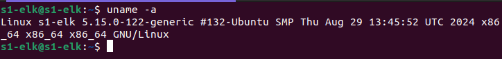
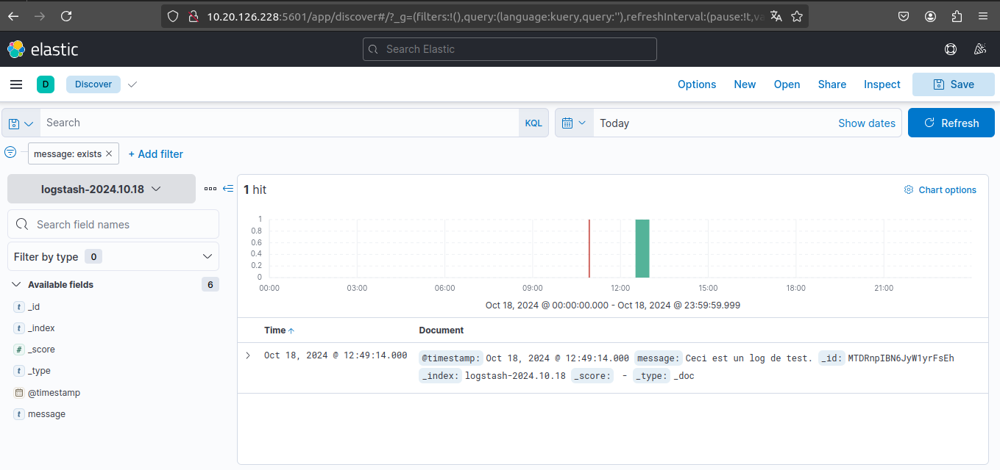
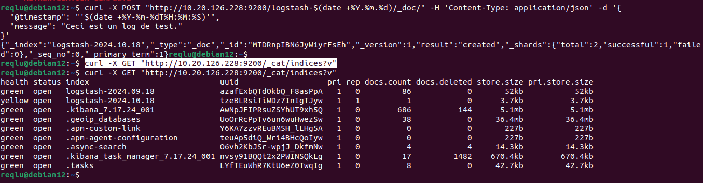
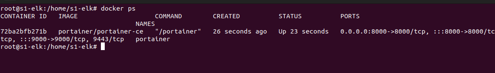
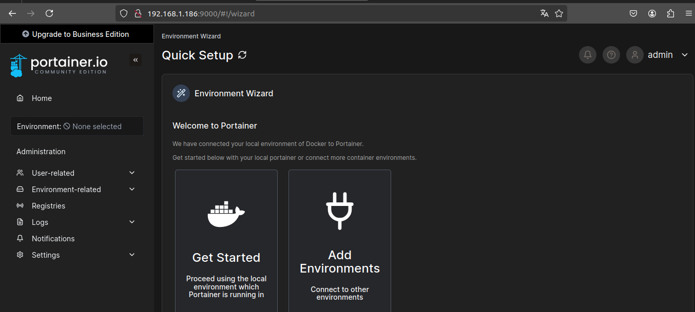
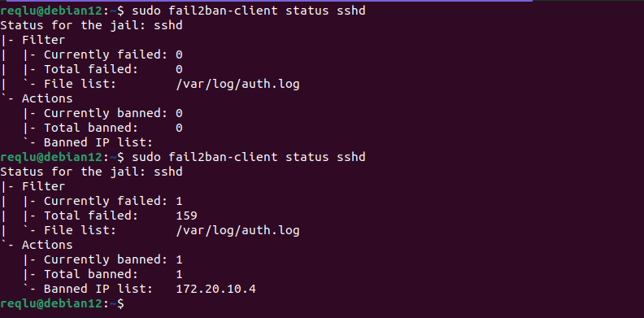
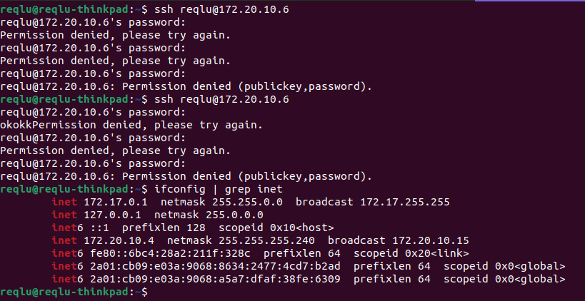

***Semaine 1***

## -> /!\  Infrastructure /!\ 

<br>

<br>

**pour commencer, voici l'architecture/système d'exploitation du serveur sur lequel mes services d'administration tournerons:**



On commence par mettre à jour nos dépôts
```apt update && apt upgrade -y```

## 1. Kibana & ElasticSearch


### On passe à l'installation du paquet ElasticSearch 
```
s1-elk@s1-elk:~$ wget -qO - https://artifacts.elastic.co/GPG-KEY-elasticsearch | sudo apt-key add -
[sudo] password for s1-elk: 
Warning: apt-key is deprecated. Manage keyring files in trusted.gpg.d instead (see apt-key(8)).
OK
s1-elk@s1-elk:~$ sudo apt-get install apt-transport-https
Reading package lists... Done
Building dependency tree... Done
Reading state information... Done
The following NEW packages will be installed:
  apt-transport-https
0 upgraded, 1 newly installed, 0 to remove and 0 not upgraded.
Need to get 1510 B of archives.
After this operation, 170 kB of additional disk space will be used.
Get:1 http://archive.ubuntu.com/ubuntu jammy-updates/universe amd64 apt-transport-https all 2.4.13 [1510 B]
Fetched 1510 B in 0s (5019 B/s)               

```
**On ajoute à notre source.list le lien vers le paquet**
<br>

```
s1-elk@s1-elk:~$ echo "deb https://artifacts.elastic.co/packages/7.x/apt stable main" | sudo tee -a /etc/apt/sources.list.d/elastic-7.x.list
deb https://artifacts.elastic.co/packages/7.x/apt stable main
s1-elk@s1-elk:~$
```
**On peut dès maintenant installer le paquet elasticsearch via apt**
<br>

```
s1-elk@s1-elk:~$ sudo apt-get install elasticsearch -y
Reading package lists... Done
Building dependency tree... Done
Reading state information... Done
The following NEW packages will be installed:
  elasticsearch
0 upgraded, 1 newly installed, 0 to remove and 0 not upgraded.
Need to get 326 MB of archives.
```
**On installe Kibana, qui est outil de visualisation de données pour le moteur d'indexation ElasticSearch. Il permet de mettre en forme les données dans des tableaux de bord interactifs.**
<br>
```
s1-elk@s1-elk:~$ sudo apt install kibana
Reading package lists... Done
Building dependency tree... Done
Reading state information... Done
The following NEW packages will be installed:
  kibana
0 upgraded, 1 newly installed, 0 to remove and 0 not upgraded.
Need to get 292 MB of archives.
After this operation, 746 MB of additional disk space will be used.
Get:1 https://artifacts.elastic.co/packages/7.x/apt stable/main amd64 kibana amd64 7.17.24 [292 MB]
Fetched 292 MB in 36s (8210 kB/s)                                                                                                                    
debconf: delaying package configuration, since apt-utils is not installed
Selecting previously unselected package kibana.
(Reading database ... 65308 files and directories currently installed.)
Preparing to unpack .../kibana_7.17.24_amd64.deb ...
Unpacking kibana (7.17.24) ...


Setting up kibana (7.17.24) ...
Creating kibana group... OK
Creating kibana user... OK

```
**On start les services ElasticSearch et Kibana**
<br>

```
s1-elk@s1-elk:~$ sudo systemctl start kibana & sudo systemctl enable kibana
[1] 15743
Synchronizing state of kibana.service with SysV service script with /lib/systemd/systemd-sysv-install.
Executing: /lib/systemd/systemd-sysv-install enable kibana
Created symlink /etc/systemd/system/multi-user.target.wants/kibana.service → /etc/systemd/system/kibana.service.
[1]+  Done                    sudo systemctl start kibana
s1-elk@s1-elk:~$ sudo systemctl status kibana
● kibana.service - Kibana
     Loaded: loaded (/etc/systemd/system/kibana.service; enabled; vendor preset: enabled)
     Active: active (running) since Wed 2024-09-18 08:45:37 UTC; 11s ago
       Docs: https://www.elastic.co
   Main PID: 15753 (node)
      Tasks: 11 (limit: 12146)
     Memory: 223.4M
        CPU: 12.192s
     CGroup: /system.slice/kibana.service
             └─15753 /usr/share/kibana/bin/../node/bin/node /usr/share/kibana/bin/../src/cli/dist --logging.dest=/var/log/kibana/kibana.log --pid.file=/run/kibana/kibana.pid "--deprecation.skip_deprecated_settings[0]=logging.dest"

Sep 18 08:45:37 s1-elk systemd[1]: Started Kibana.
Sep 18 08:45:38 s1-elk kibana[15753]: Kibana is currently running with legacy OpenSSL providers enabled! For details and instructions on how to disable see https://www.elastic.co/guide/en/kibana/7.17/production.html#openssl-legacy-provider
s1-elk@s1-elk:~$
```

## Logstash 
**On installe le paquet logstash via apt**
<br>
```
s1-elk@s1-elk:~$ sudo apt install logstash
[sudo] password for s1-elk: 
Reading package lists... Done
Building dependency tree... Done
Reading state information... Done
The following NEW packages will be installed:
  logstash
0 upgraded, 1 newly installed, 0 to remove and 0 not upgraded.
Need to get 371 MB of archives.
After this operation, 629 MB of additional disk space will be used.
Get:1 https://artifacts.elastic.co/packages/7.x/apt stable/main amd64 logstash amd64 1:7.17.24-1 [371 MB]
Fetched 371 MB in 1min 35s (3912 kB/s)                                         
debconf: delaying package configuration, since apt-utils is not installed
Selecting previously unselected package logstash.
(Reading database ... 115191 files and directories currently installed.)
Preparing to unpack .../logstash_1%3a7.17.24-1_amd64.deb ...
Unpacking logstash (1:7.17.24-1) ...

Setting up logstash (1:7.17.24-1) ...


```
<br>

**Désormais, on passe à la configuration de logstash afin de faire des remontés depuis le client <br>Le retour sera afficher en format web sur le port 9000.**

```
s1-elk@s1-elk:~$ cat /etc/logstash/conf.d/logstash.conf
input {
  udp {
    port => 514
    type => "syslog"
  }
}

output {
  elasticsearch {
    hosts => ["localhost:9200"]
    index => "logstash-%{+YYYY.MM.dd}"
  }
}

s1-elk@s1-elk:~$ sudo systemctl start logstash
s1-elk@s1-elk:~$ sudo systemctl enable logstash
Created symlink /etc/systemd/system/multi-user.target.wants/logstash.service → /etc/systemd/system/logstash.service.


s1-elk@s1-elk:~$ sudo systemctl status logstash
● logstash.service - logstash
     Loaded: loaded (/etc/systemd/system/logstash.service; enabled; vendor preset: enabled)
     Active: active (running) since Wed 2024-09-18 08:58:50 UTC; 44s ago
   Main PID: 16582 (java)
      Tasks: 38 (limit: 12146)
     Memory: 545.8M
        CPU: 1min 12.231s

```
**Logstash est désormais démarré et actif sur notre serveur.**

## 2 Bis (En plus). RsysLog Client & Serveur 
**On installe le paquet rsyslog, et on configure le service afin de faire des remontées**
<br>
```
reqlu@debian-12:~$ sudo apt-get install rsyslog -y
Reading package lists... Done
Building dependency tree... Done
Reading state information... Done
The following additional packages will be installed:
  libestr0 libfastjson4 logrotate
Suggested packages:
  bsd-mailx | mailx rsyslog-mysql | rsyslog-pgsql rsyslog-mongodb rsyslog-doc rsyslog-openssl | rsyslog-gnutls rsyslog-gssapi rsyslog-relp
The following NEW packages will be installed:
  libestr0 libfastjson4 logrotate rsyslog
0 upgraded, 4 newly installed, 0 to remove and 0 not upgraded.
Need to get 582 kB of archives.
After this operation, 2065 kB of additional disk space will be used.
Get:1 http://archive.ubuntu.com/ubuntu jammy/main amd64 libestr0 amd64 0.1.10-2.1build3 [7796 B]
Get:2 http://archive.ubuntu.com/ubuntu jammy/main amd64 libfastjson4 amd64 0.99.9-1build2 [23.0 kB]
Get:3 http://archive.ubuntu.com/ubuntu jammy-updates/main amd64 logrotate amd64 3.19.0-1ubuntu1.1 [54.3 kB]
Get:4 http://archive.ubuntu.com/ubuntu jammy-updates/main amd64 rsyslog amd64 8.2112.0-2ubuntu2.2 [497 kB]
Fetched 582 kB in 1s (409 kB/s)  
debconf: delaying package configuration, since apt-utils is not installed
Selecting previously unselected package libestr0:amd64.
(Reading database ... 130619 files and directories currently installed.)
Preparing to unpack .../libestr0_0.1.10-2.1build3_amd64.deb ...

reqlu@debian12:~$ sudo systemctl status rsyslog
● rsyslog.service - System Logging Service
     Loaded: loaded (/lib/systemd/system/rsyslog.service; enabled; vendor preset: enabled)
     Active: active (running) since Wed 2024-09-18 09:02:09 UTC; 45s ago
TriggeredBy: ● syslog.socket
       Docs: man:rsyslogd(8)
             man:rsyslog.conf(5)
             https://www.rsyslog.com/doc/
   Main PID: 17150 (rsyslogd)
      Tasks: 4 (limit: 12146)
     Memory: 1.7M
        CPU: 19ms

reqlu@debian12:~$ uname -a
Linux debian12 6.1.0-25-amd64 #1 SMP PREEMPT_DYNAMIC Debian 6.1.106-3 (2024-08-26) x86_64 GNU/Linux
reqlu@debian12:~$

reqlu@debian12:~$ systemctl status rsyslog
● rsyslog.service - System Logging Service
     Loaded: loaded (/lib/systemd/system/rsyslog.service; enabled; preset: enabled)
     Active: active (running) since Wed 2024-09-18 11:31:40 CEST; 2min 12s ago
TriggeredBy: ● syslog.socket
       Docs: man:rsyslogd(8)
reqlu@debian12:~$ sudo cat /etc/rsyslog.d/50-default.conf
*.* @@<IP_SERVEUR>:514   => @ = UDP @@ = TCP
reqlu@debian12:~$
```
## Resumé 1 , 2 , 2Bis:

### Service web ElasticSearch : 


<br>

### Test de remontée via Logstash :



## 3. Portainer ( Gestion des conteneurs )

<i>Portainer est une interface graphique de gestion pour Docker et les environnements de conteneurs (comme Docker Swarm et Kubernetes). Elle simplifie la gestion des conteneurs, images, volumes, réseaux, et autres aspects de Docker à travers une interface utilisateur intuitive, ce qui est particulièrement utile pour les administrateurs système et les développeurs.</i>
<br>
### On passe à l'installation:
```
sudo apt install docker.io -y     # installation du paquet docker
sudo docker volume create portainer_data  # on make un volume pour y pull l'image de portainer

sudo docker run -d -p 8000:8000 -p 9000:9000 \
  --name=portainer --restart=always \
  -v /var/run/docker.sock:/var/run/docker.sock \
  -v portainer_data:/data \
  portainer/portainer-ce            # on télécharge l'image dans notre volume

sudo docker update --restart=always portainer  # lancement dès le démarrage du serveur
sudo docker start portainer                    # on démarre le conteneur

```

### Processus Docker 

<br>

### Service web Portainer 


## 4. Fail2ban ( 4 SSH Service )

### Installation de Fail2ban

Suivre doc : <a href="https://doc.fedora-fr.org/wiki/SSH_:_Se_prot%C3%A9ger_des_attaques_avec_fail2ban">Doc Fedora Fail2ban</a>

```
reqlu@debian12:~$ sudo apt-get install fail2ban -y
Lecture des listes de paquets... Fait
Construction de l'arbre des dépendances... Fait
Lecture des informations d'état... Fait      
Les paquets supplémentaires suivants seront installés : 
  python3-pyinotify python3-systemd whois
Paquets suggérés :
  mailx monit sqlite3 python-pyinotify-doc
Les NOUVEAUX paquets suivants seront installés :
  fail2ban python3-pyinotify python3-systemd whois
0 mis à jour, 4 nouvellement installés, 0 à enlever et 71 non mis à jour.
Il est nécessaire de prendre 589 ko dans les archives.
Après cette opération, 2 901 ko d'espace disque supplémentaires seront utilisés.
Réception de :1 https://ftp.debian.org/debian bookworm/main amd64 fail2ban all 1.0.2-2 [451 kB]

reqlu@debian12:~$ sudo cp /etc/fail2ban/jail.conf /etc/fail2ban/jail.local
reqlu@debian12:~$ sudo less /etc/fail2ban/jail.local

bantime  = 2m

# A host is banned if it has generated "maxretry" during the last "findtime"
# seconds.
findtime  = 10m

# "maxretry" is the number of failures before a host get banned.
maxretry = 2

reqlu@debian12:~$ systemctl start fail2ban.service
==== AUTHENTICATING FOR org.freedesktop.systemd1.manage-units ====
Authentification requise pour démarrer « fail2ban.service ».
Authenticating as: root
Password: 
==== AUTHENTICATION COMPLETE ====
reqlu@debian12:~$ systemctl status fail2ban.service
● fail2ban.service - Fail2Ban Service
     Loaded: loaded (/lib/systemd/system/fail2ban.service; enabled; preset: enabled)
     Active: active (running) since Tue 2024-10-29 14:09:20 CET; 6min ago
       Docs: man:fail2ban(1)
   Main PID: 2450 (fail2ban-server)
      Tasks: 5 (limit: 5951)
     Memory: 46.9M
        CPU: 1min 58.375s
     CGroup: /system.slice/fail2ban.service
             └─2450 /usr/bin/python3 /usr/bin/fail2ban-server -xf start
reqlu@debian12:~$
```
## Résultat Fail2ban: 

<br>



