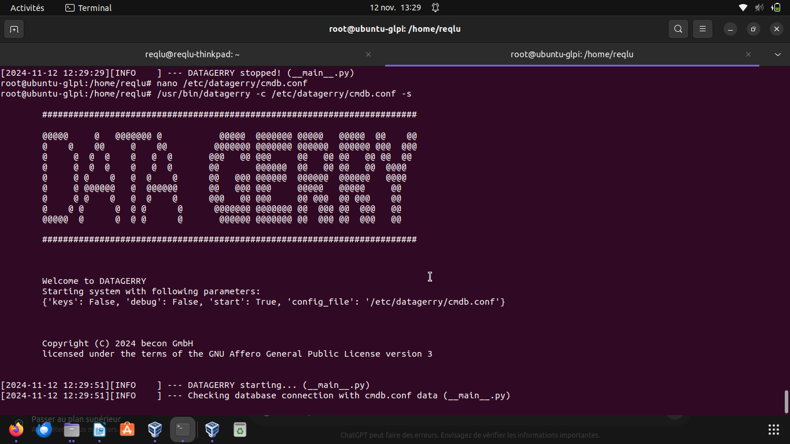

<i>Semaine 3 : Applications métiers et bases de données</i>

## /!\ Infrastructure /!\

<br>

## 1. GLPI - Système de gestion de parc informatique et de helpdesk.
<br>

<br>
GLPI étant déjà installé sur mon système, je vérifie juste l'accès au service ainsi qu'a sa base de données.


<br>

```
reqlu@ubuntu-glpi:~$ sudo mysql
Welcome to the MySQL monitor.  Commands end with ; or \g.
Your MySQL connection id is 52
Server version: 8.0.35-0ubuntu0.22.04.1 (Ubuntu)

Copyright (c) 2000, 2023, Oracle and/or its affiliates.

Oracle is a registered trademark of Oracle Corporation and/or its
affiliates. Other names may be trademarks of their respective
owners.

Type 'help;' or '\h' for help. Type '\c' to clear the current input statement.

mysql> SHOW DATABASES;
+--------------------+
| Database           |
+--------------------+
| TC2_test           |
| db2023_glpi        |
| information_schema |
| mysql              |
| ocsdb              |
| performance_schema |
| sys                |
| tournoi_foot       |
+--------------------+
8 rows in set (0,00 sec)

mysql> use db2023_glpi;
Reading table information for completion of table and column names
You can turn off this feature to get a quicker startup with -A


Database changed
mysql> 
mysql> SHOW TABLES;
+----------------------------------------------------------+
| Tables_in_db2023_glpi                                    |
+----------------------------------------------------------+
| glpi_agents                                              |
| glpi_agenttypes                                          |
| glpi_alerts                                              |
| glpi_apiclients                                          |
| glpi_applianceenvironments                               |
| glpi_appliances                                          |
| glpi_appliances_items                                    |
| glpi_appliances_items_relations                          |
| glpi_appliancetypes                                      |
| glpi_authldapreplicates                                  |
| glpi_authldaps                                           |
| glpi_authmails                                           |
| glpi_autoupdatesystems                                   |
| glpi_blacklistedmailcontents                             |
```
Je vérifie également le port utilisé par le service MYSQL, pour qu'il n'y ai pas de conflit entre POSTGRESQL et MySQL.

```
mysql> SHOW GLOBAL VARIABLES LIKE "PORT";
+---------------+-------+
| Variable_name | Value |
+---------------+-------+
| port          | 3306  |
+---------------+-------+
1 row in set (0,04 sec)

mysql>
```

## 2. PostgreSQL - Système de gestion de bases de données relationnelles, souvent utilisé avec iTop ou GLPI.
<br>

<br>

### Installation & Setup

```
reqlu@ubuntu-glpi:~$ sudo apt install postgresql postgresql-contrib -y
Reading package lists... Done
Building dependency tree... Done
Reading state information... Done
Les paquets suivants ont été installés automatiquement et ne sont plus nécessaires :
  fonts-glyphicons-halflings ieee-data libapache-dbi-perl libarchive-zip-perl libblas3 libjs-bootstrap libjs-jquery-datatables
  libjs-jquery-file-upload libjs-jquery-migrate-1 libjs-select2.js libldb2 liblinear4 libphp-phpmailer libswitch-perl libtalloc2 libtdb1 libtevent0
  libwbclient0 lua-lpeg nmap nmap-common ocsinventory-reports php-cas php-ldap php-pclzip php-soap php8.1-ldap php8.1-soap phpqrcode
  python-pkg-resources python-setuptools python3-gpg python3-ldb python3-samba python3-talloc python3-tdb samba-common samba-common-bin
  samba-dsdb-modules samba-libs
Veuillez utiliser « sudo apt autoremove » pour les supprimer.
Les paquets supplémentaires suivants seront installés : 
  libcommon-sense-perl libjson-perl libjson-xs-perl libllvm14 libpq5 libsensors-config libsensors5 libtypes-serialiser-perl postgresql-14
  postgresql-client-14 postgresql-client-common postgresql-common sysstat
```

### Setup :

```
reqlu@ubuntu-glpi:~$ sudo -i -u postgres
postgres@ubuntu-glpi:~$ psql
psql (14.13 (Ubuntu 14.13-0ubuntu0.22.04.1))
Type "help" for help.

postgres=# CREATE DATABASE itop_db;
CREATE DATABASE
postgres=# CREATE USER itop_user WITH PASSWORD 'itop2024';
CREATE ROLE
postgres=# GRANT ALL PRIVILEGES ON DATABASE itop_db TO itop_user;
GRANT
postgres=# CREATE DATABASE datagerry_db;
CREATE DATABASE
postgres=# CREATE USER datagerry_user WITH PASSWORD 'datagerry2024';
CREATE ROLE
postgres=# GRANT ALL PRIVILEGES ON DATABASE datagerry_db TO datagerry_user;
GRANT
postgres=# \q
postgres@ubuntu-glpi:~$ exit
logout
reqlu@ubuntu-glpi:~$
```

## 3. iTop - Outil de gestion des services IT, similaire à GLPI.
<br>

<br>

##  Setup MySQL

```
mysql> CREATE DATABASE itop_db CHARACTER SET utf8 COLLATE utf8_general_ci;
Query OK, 1 row affected, 2 warnings (0,04 sec)
mysql> CREATE USER 'itop_user'@'localhost' IDENTIFIED BY 'itop_Password_2024!';
Query OK, 0 rows affected (0,08 sec)
mysql> GRANT ALL PRIVILEGES ON itop_db.* TO 'itop_user'@'localhost';
Query OK, 0 rows affected (0,03 sec)
mysql> FLUSH PRIVILEGES;
Query OK, 0 rows affected (0,02 sec)


```
### Installation des extensions :

```
reqlu@ubuntu-glpi:~$ sudo apt install apache2 php libapache2-mod-php php-pgsql php-mbstring php-gd php-xml php-ldap php-curl -y
Reading package lists... Done
Building dependency tree... Done
Reading state information... Done
libapache2-mod-php est déjà la version la plus récente (2:8.1+92ubuntu1).
php est déjà la version la plus récente (2:8.1+92ubuntu1).
php-curl est déjà la version la plus récente (2:8.1+92ubuntu1).
php-gd est déjà la version la plus récente (2:8.1+92ubuntu1).
php-ldap est déjà la version la plus récente (2:8.1+92ubuntu1).
php-ldap passé en « installé manuellement ».
php-xml est déjà la version la plus récente (2:8.1+92ubuntu1).
php-mbstring est déjà la version la plus récente (2:8.1+92ubuntu1).
Les paquets suivants ont été installés automatiquement et ne sont plus nécessaires :
  fonts-glyphicons-halflings ieee-data libapache-dbi-perl libarchive-zip-perl libblas3 libjs-bootstrap libjs-jquery-datatables
  libjs-jquery-file-upload libjs-jquery-migrate-1 libjs-select2.js libldb2 liblinear4 libphp-phpmailer libswitch-perl libtalloc2 libtdb1 libtevent0
  libwbclient0 lua-lpeg nmap nmap-common ocsinventory-reports php-cas php-pclzip php-soap php8.1-soap phpqrcode python-pkg-resources
  python-setuptools python3-gpg python3-ldb python3-samba python3-talloc python3-tdb samba-common samba-common-bin samba-dsdb-modules samba-libs
reqlu@ubuntu-glpi:~$ sudo apt install graphviz -y
Reading package lists... Done
Building dependency tree... Done
Reading state information... Done
Les paquets suivants ont été installés automatiquement et ne sont plus nécessaires :
  fonts-glyphicons-halflings ieee-data libapache-dbi-perl libarchive-zip-perl libblas3 libjs-bootstrap libjs-jquery-datatables
  libjs-jquery-file-upload libjs-jquery-migrate-1 libjs-select2.js libldb2 liblinear4 libphp-phpmailer libswitch-perl libtalloc2 libtdb1 libtevent0
  libwbclient0 lua-lpeg nmap nmap-common ocsinventory-reports php-cas php-pclzip php-soap php8.1-soap phpqrcode python-pkg-resources
  python-setuptools python3-gpg python3-ldb python3-samba python3-talloc python3-tdb samba-common samba-common-bin samba-dsdb-modules samba-libs
Veuillez utiliser « sudo apt autoremove » pour les supprimer.
Les paquets supplémentaires suivants seront installés : 
  fonts-liberation libann0 libcdt5 libcgraph6 libgts-0.7-5 libgts-bin libgvc6 libgvpr2 libice6 liblab-gamut1 libpathplan4 libsm6 libxaw7 libxmu6
  libxt6
Paquets suggérés :
  graphviz-doc
```

### Installation iTop

```
reqlu@ubuntu-glpi:~$ curl -L -o itop.zip https://sourceforge.net/projects/itop/files/latest/download
  % Total    % Received % Xferd  Average Speed   Time    Time     Time  Current
                                 Dload  Upload   Total   Spent    Left  Speed
100   631  100   631    0     0    516      0  0:00:01  0:00:01 --:--:--   516
100   373  100   373    0     0    150      0  0:00:02  0:00:02 --:--:--  1734
100 31.8M  100 31.8M    0     0   343k      0  0:01:35  0:01:35 --:--:--  379k
reqlu@ubuntu-glpi:~$ ls
itop.zip  python
reqlu@ubuntu-glpi:~$ sudo unzip itop.zip -d /var/www/html/itop
Archive:  itop.zip
  inflating: /var/www/html/itop/INSTALL  
  inflating: /var/www/html/itop/LICENSE  
  inflating: /var/www/html/itop/web/addons/userrights/userrightsmatrix.class.inc.php  
  inflating: /var/www/html/itop/web/addons/userrights/userrightsnull.class.inc.php  
  inflating: /var/www/html/itop/web/addons/userrights/userrightsprofile.class.inc.php  
  inflating: /var/www/html/itop/web/addons/userrights/userrightsprofile.db.class.inc.php  
  inflating: /var/www/html/itop/web/addons/userrights/userrightsprojection.class.inc.php  
  inflating: /var/www/html/itop/web/app.php  
  inflating: /var/www/html/itop/web/application/DBSearchHelper.php  
  inflating: /var/www/html/itop/web/application/ajaxwebpage.class.inc.php  
  inflating: /var/www/html/itop/web/application/application.inc.php  
  inflating: /var/www/html/itop/web/application/applicationcontext.class.inc.php  
  inflating: /var/www/html/itop/web/application/applicationextension.inc.php  
  inflating: /var/www/html/itop/web/application/audit.category.class.inc.php  
  inflating: /var/www/html/itop/web/application/audit.domain.class.inc.php  
  inflating: /var/www/html/itop/web/application/audit.rule.class.inc.php  
  inflating: /var/www/html/itop/web/application/capturewebpage.class.inc.php  
  inflating: /var/www/html/itop/web/application/clipage.class.inc.php  
  inflating: /var/www/html/itop/web/application/cmdbabstract.class.inc.php  
  inflating: /var/www/html/itop/web/application/compilecssservice.class.inc.php  
  inflating: /var/www/html/itop/web/application/csvpage.class.inc.php  
  inflating: /var/www/html/itop/web/application/dashboard.class.inc.php  
  inflating: /var/www/html/itop/web/application/dashboardlayout.class.inc.php  
  ---------
reqlu@ubuntu-glpi:~$ sudo chown -R www-data:www-data /var/www/html/itop
reqlu@ubuntu-glpi:~$ sudo chmod -R 755 /var/www/html/itop
reqlu@ubuntu-glpi:~$ ls -la /var/www/html/
total 24
drwxr-xr-x 3 root     root      4096 oct.  29 14:10 .
drwxr-xr-x 3 root     root      4096 nov.  27  2023 ..
-rw-r--r-- 1 root     root     10671 nov.  27  2023 index.html
drwxr-xr-x 3 www-data www-data  4096 oct.  29 14:10 itop
reqlu@ubuntu-glpi:~$ sudo systemctl restart apache2
reqlu@ubuntu-glpi:~$ sudo systemctl status apache2
● apache2.service - The Apache HTTP Server
     Loaded: loaded (/lib/systemd/system/apache2.service; enabled; vendor preset: enabled)
     Active: active (running) since Tue 2024-10-29 14:12:13 UTC; 5s ago
```

## iTop Version Web


Une fois installé on obtient l'interface suivante:

<br>

<br>

## 5. Postfix - Serveur de messagerie électronique pour gérer l’envoi et la réception des emails.
<br>


<br>

**Postfix est un serveur de messagerie (MTA) utilisé pour envoyer des emails en local ou vers l'extérieur. En local, il reçoit des emails des utilisateurs ou des applications sur le même système et les distribue dans les boîtes de réception locales. Si configuré pour l’envoi externe, il peut aussi relayer les emails vers des serveurs SMTP externes. Simple à configurer pour une utilisation locale, Postfix fonctionne en arrière-plan, gère les files d’attente d’emails, et consigne ses activités dans les journaux système pour faciliter le suivi.**

### Démonstration en local
***Envoi d'un mail via le client <a href="https://doc.ubuntu-fr.org/mutt">mutt</a>***
<br>

<br>
***Ouverture du mail***
<br>

<br>

## (More) 6. Datagerry - Outil de gestion de la documentation pour les infrastructures IT

On va chercher le paquet deb sur le lien suivant :

ensuite, on configure dans /etc/datagerry/cmbd.conf les accès à la base de donnée.

On lance datagerry :


